# github-markdown-css

The minimal amount of CSS to replicate the GitHub Markdown style.

The CSS is generated. Contributions should go to [this repo](https://github.com).

## Demo
Integrated file tree offline preview is ready!

## Từ điển Thuật ngữ

Thuật ngữ số 1
: Đây là định nghĩa chi tiết dành cho thuật ngữ số một.

Thuật ngữ số 2
: Đây là dòng định nghĩa đầu tiên của thuật ngữ hai.
: Đây là dòng định nghĩa bổ sung tiếp theo.

```mermaid
graph TD
    %% Định nghĩa phong cách cho các khối theo chuẩn v11
    style A fill:#2b7a78,stroke:#17252a,stroke-width:2px,color:#fff
    style B fill:#3aafa9,stroke:#17252a,stroke-width:2px,color:#fff
    style C fill:#feffff,stroke:#17252a,stroke-width:1px,color:#17252a
    style C1 fill:#feffff,stroke:#17252a,stroke-width:1px,color:#17252a
    style C2 fill:#feffff,stroke:#17252a,stroke-width:1px,color:#17252a
    style D fill:#3aafa9,stroke:#17252a,stroke-width:2px,color:#fff
    style D1 fill:#feffff,stroke:#17252a,stroke-width:1px,color:#17252a
    style D2 fill:#feffff,stroke:#17252a,stroke-width:1px,color:#17252a
    style E fill:#feffff,stroke:#17252a,stroke-width:1px,color:#17252a
    style E1 fill:#feffff,stroke:#17252a,stroke-width:1px,color:#17252a
    style E2 fill:#feffff,stroke:#17252a,stroke-width:1px,color:#17252a
    style E3 fill:#feffff,stroke:#17252a,stroke-width:1px,color:#17252a
    style F fill:#feffff,stroke:#17252a,stroke-width:1px,color:#17252a
    style F1 fill:#feffff,stroke:#17252a,stroke-width:1px,color:#17252a
    style G fill:#feffff,stroke:#17252a,stroke-width:1px,color:#17252a
    style G1 fill:#3aafa9,stroke:#17252a,stroke-width:2px,color:#fff
    style G2 fill:#feffff,stroke:#17252a,stroke-width:1px,color:#17252a
    style G3 fill:#feffff,stroke:#17252a,stroke-width:1px,color:#17252a
    style H fill:#3aafa9,stroke:#17252a,stroke-width:2px,color:#fff
    style I fill:#28a745,stroke:#1e7e34,stroke-width:2px,color:#fff
    style J fill:#dc3545,stroke:#bd2130,stroke-width:2px,color:#fff

    %% Khởi tạo luồng xử lý
    A(["Bắt đầu: Khởi tạo Mermaid"])

    %% Bước kiểm tra thư viện
    A --> B{"Đã nhúng thư viện Mermaid?"}
    B -- "Chưa" --> C["Chọn phương thức nhúng"]
    C --> C1["Nhúng qua CDN<br/>(Unpkg hoặc CDNJS)"]
    C --> C2["Cài đặt qua NPM<br/>(npm install mermaid)"]
    
    C1 --> D{"Chọn phiên bản"}
    C2 --> D
    D -- "Bản mới nhất" --> D1["Sử dụng script<br/>type='module'"]
    D -- "Bản cổ điển" --> D2["Sử dụng script<br/>thông thường"]
    B -- "Rồi" --> E["Cấu hình Mermaid Config"]

    %% Cấu hình hệ thống
    D1 --> E
    D2 --> E
    E --> E1["Thiết lập chủ đề:<br/>base, dark, forest"]
    E --> E2["Tùy chỉnh font chữ<br/>và khoảng cách"]
    E --> E3["Thiết lập bảo mật:<br/>securityLevel"]

    %% Khai báo nội dung HTML
    E1 --> F["Khai báo sơ đồ trong HTML"]
    E2 --> F
    E3 --> F
    F --> F1["Viết cú pháp Mermaid<br/>trong thẻ pre class='mermaid'"]
    
    %% Chạy ứng dụng
    F1 --> G["Chạy hàm khởi tạo"]
    G --> G1{"Phương thức chạy?"}
    G1 -- "Gọi trực tiếp" --> G2["Sử dụng hàm<br/>mermaid.run()"]
    G1 -- "Tự động" --> G3["Tự động quét và<br/>render toàn trang"]

    %% Đầu ra và Kiểm tra lỗi
    G2 --> H{"Render thành công?"}
    G3 --> H
    H -- "Có" --> I(("(Hiển thị sơ đồ 🎉)"))
    H -- "Không" --> J["Xử lý lỗi /<br/>Kiểm tra lại cú pháp"]
    J --> F1
```

